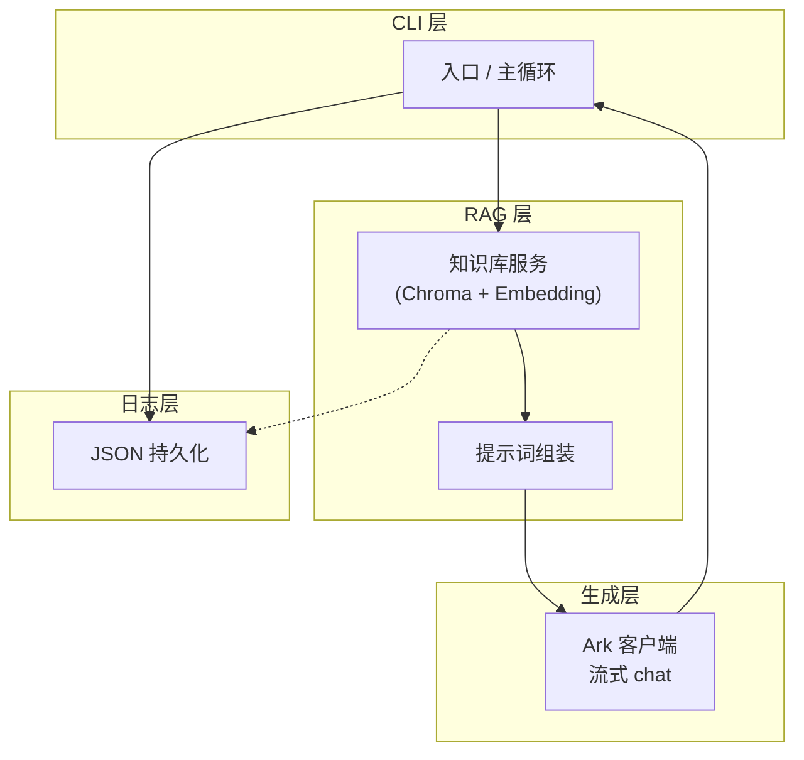
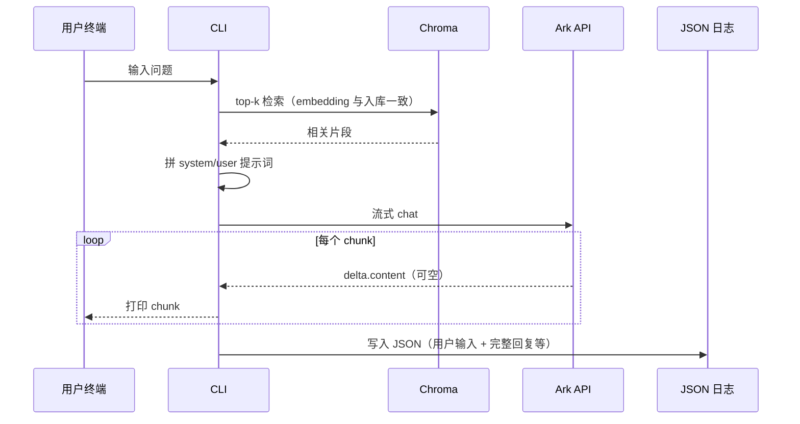

# 02 概要设计 — 美食/超市商品导购助手（CLI + RAG）

## 1. 文档说明

- **依据**：`01需求文档.md`（已冻结）。  
- **范围**：描述系统边界、逻辑架构、模块划分与数据流；不涉及类级设计与具体接口签名（实现阶段细化）。

---

## 2. 设计目标

| 目标 | 说明 |
|------|------|
| 链路闭环 | 在单进程内完成「向量检索 → 提示词组装 → Ark 流式生成 → 终端输出 → JSON 落盘」。 |
| 简单可测 | 模块少、依赖清晰，便于验收与迭代。 |
| 与需求一致 | Chroma、Ark SDK、`ARK_API_KEY`、流式 chunk 处理、JSON 日志等约束均在设计层落实。 |

---

## 3. 总体架构

### 3.1 形态

- **单进程命令行应用**：无 Web/桌面 GUI；用户通过终端输入问题，结果流式打印到 stdout。  
- **外部依赖**：本地或进程内 Chroma 向量库；火山引擎 Ark API（豆包模型）。

### 3.2 逻辑分层（概念）



- **CLI 层**：解析参数/环境、驱动交互循环、协调各模块、将流式 token 写出。  
- **RAG 层**：文档入库与查询时 top-k 检索；将检索文本注入 system/user。  
- **生成层**：封装 `volcenginesdkarkruntime`，`stream=True`，安全处理空 `choices` / 空 `delta.content`，结束后换行。  
- **日志层**：每次交互聚合「用户问题、可选检索摘要、拼接后的完整回复、时间戳」等，写入 JSON 文件或目录下文件。

---

## 4. 核心数据流（与需求 FR 对应）



1. **查库**：用户问题 → embedding → Chroma similarity search → top-k 文本块。  
2. **拼 prompt**：固定导购角色 system + 检索上下文 + 用户问题（user）。  
3. **调 Ark**：流式请求，逐 chunk 打印 `chunk.choices[0].delta.content`；容错空 chunk。  
4. **日志**：流式结束后拼接完整回复，与时间、问题等一并 JSON 落盘。

---

## 5. 模块划分（建议）

| 模块 | 职责 | 备注 |
|------|------|------|
| **config** | 读取环境变量（如 `ARK_API_KEY`）、可选配置文件路径（Chroma 路径、模型名、top-k、日志路径） | 密钥不落代码 |
| **ingest**（或与 kb 合并） | 结构化商品/美食数据 → 分块/chunk → embedding → 写入 Chroma | 可与 CLI 子命令 `ingest` 绑定 |
| **kb / chroma_store** | 封装 collection 创建、持久化路径、查询接口 | 与 ingest 共用同一 embedding 策略 |
| **llm / ark_client** | 创建 `Ark(api_key=...)`，封装流式调用与 chunk 迭代 | 模型 ID 可配置，默认对齐需求示例 |
| **prompt** | 模板：system 导购说明 + 检索片段占位 + user 问题 | 保持单一职责，便于调 prompt |
| **logging / session_log** | 追加或按会话写 JSON 行（JSON Lines 便于流式追加） | 路径由 config 约定并文档化 |
| **cli** | `argparse` 或等价：主循环、子命令（如 `chat` / `ingest`）、信号与退出 | 单入口 |

实现时可合并小模块（例如 `prompt` 内联于 `cli`），但边界上仍建议保持「检索 / 生成 / 日志」分离以便测试。

---

## 6. 关键技术选型（冻结需求对齐）

| 项 | 选型 |
|----|------|
| 语言与运行时 | Python 3（版本在 `requirements.txt` 或 README 中锁定建议范围） |
| 向量库 | Chroma（持久化目录由配置指定） |
| Embedding | 与 Chroma 查询一致的模型（实现时二选一并在 ingest 与 query 共用） |
| 大模型 | 豆包 via `volcenginesdkarkruntime`，`Ark(api_key=os.environ["ARK_API_KEY"])` |
| 流式输出 | `stream=True`；打印 `delta.content`；处理边界情况；结束换行 |
| 依赖清单 | `requirements.txt` |
| 日志 | JSON，可配置单文件或目录 + 滚动策略（实现约定） |

---

## 7. 配置与运行视图

- **环境变量**：至少 `ARK_API_KEY`；可选 `CHROMA_PATH`、`LOG_PATH`、`ARK_MODEL`、`TOP_K` 等（实现时在 README 列全）。  
- **数据目录**：Chroma 数据目录与示例源数据（如 `data/`）分离，避免把大文件误提交（`.gitignore` 约定）。  
- **无多进程/无队列**：验收场景下单进程足够。

---

## 8. 建议目录结构（实现参考）

```
productGuide/
├── README.md                 # 环境、ARK_API_KEY、运行方式
├── requirements.txt
├── 01需求文档.md
├── 02概要设计.md
├── src/                      # 或扁平包名，如 product_guide/
│   ├── __main__.py           # python -m 入口
│   ├── cli.py
│   ├── config.py
│   ├── kb.py                 # Chroma + 检索
│   ├── ingest.py             # 入库
│   ├── ark_client.py
│   └── json_log.py
├── data/                     # 示例结构化数据（可版本管理）
└── chroma_db/                # 本地向量库（通常 gitignore）
```

具体文件名可在编码阶段微调，保持「入口 → kb → ark → log」依赖方向单向即可。

---

## 9. 非功能设计要点

- **错误处理**：网络/API 失败时向 stderr 输出可读信息，不崩溃泄露密钥；检索为空时仍可调模型（prompt 中注明「无检索结果」），行为在实现时固定并写入 README。  
- **可复现**：依赖版本固定；日志含时间戳与完整模型输出便于对比版本。  
- **扩展**：后续若增加 Web，可复用 `kb` + `ark_client`，仅替换 CLI 为 HTTP 层（本阶段不实现）。

---

## 10. 与需求验收的映射

| 验收要点 | 概要设计落点 |
|----------|----------------|
| CLI 流式导购 | §3 CLI 层 + §4 Ark 流式循环 |
| Chroma 参与生成 | §3 RAG 层 + §4 查库步骤 |
| Ark SDK + 环境变量 + 流式 chunk | §3 生成层 + §6 |
| JSON 落盘 | §3 日志层 + §5 `session_log` |

---

## 11. 修订记录

| 版本 | 日期 | 说明 |
|------|------|------|
| 0.1 | 2026-04-05 | 初稿，与 `01需求文档.md` 冻结版一致 |
